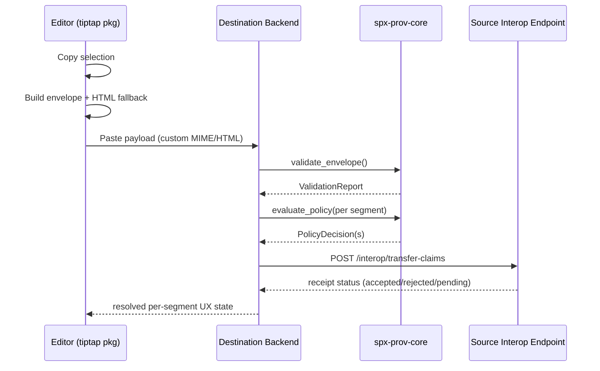

# Public Libraries Implementation Plan (`spx-prov`)

Date: 2026-03-02

## 1) Scope and Inputs

This plan defines the technical design and candidate public APIs for the libraries described in:

- `provenance_cloud/docs/library_considerations.md` (especially "Library roadmap aligned to your proposed split")
- `provenance/README.md`
- `provenance/docs/draft_plan_1.md`
- `provenance/docs/protocol_draft_3.md`

Goal: ship public Apache-2.0 libraries that let third parties implement `spx-prov` protocol behavior (clipboard + handshake + policy + agent/tool governance) without using the private cloud implementation.

## 2) Repository Strategy Recommendation

Short answer: keep these public libraries in the `provenance` repo now, as a single multi-language monorepo.

Why this is the right default now:

- Protocol and SDKs are still draft-stage (`0.x`), so tight coordination is more important than independent repo autonomy.
- Cross-language conformance vectors should evolve atomically with protocol docs.
- A single release train is easier while API shapes are settling.

When to split repos later:

- If Rust core release cadence materially diverges from TS/Python wrappers.
- If external contributor volume to one language ecosystem starts creating noisy CI/review bottlenecks.
- If package ownership becomes distinct enough to justify independent governance and versioning.

## 3) Target Library Set

Initial public set (aligned to roadmap):

1. `@provenance/spx-prov-spec`
2. `spx-prov-core` (Rust crate)
3. `@provenance/spx-prov-node` (Node wrapper over Rust core)
4. `spx_prov` (Python package over Rust core)
5. `@provenance/spx-prov-tiptap`

Recommended extra package for ecosystem quality:

6. `@provenance/spx-prov-conformance` (test vectors + harness utilities)

## 4) High-Level Architecture

```mermaid
flowchart LR
  subgraph SpecLayer[Spec + Vectors]
    SPEC[@provenance/spx-prov-spec]
    VECTORS[conformance vectors]
  end

  subgraph CoreLayer[Rust Canonical Engine]
    CORE[spx-prov-core]
  end

  subgraph Bindings[Language Bindings]
    NODE[@provenance/spx-prov-node]
    PY[spx_prov]
  end

  subgraph ClientLayer[Editor Integration]
    TIPTAP[@provenance/spx-prov-tiptap]
  end

  SPEC --> CORE
  VECTORS --> CORE
  CORE --> NODE
  CORE --> PY
  SPEC --> TIPTAP
  VECTORS --> NODE
  VECTORS --> PY
  VECTORS --> TIPTAP
```

Design principle: one canonical correctness engine (`spx-prov-core`), thin language bindings, and a TS-first editor package for browser integration.

## 5) Proposed Folder Structure (`provenance`)

```text
provenance/
  docs/
    protocol_draft_3.md
    libraries_plan.md
  schemas/
    spx-prov-envelope-0.3.schema.json
    spx-prov-claim-0.3.schema.json
    spx-prov-receipt-0.3.schema.json
    spx-prov-tool-input-0.3.schema.json
    spx-prov-tool-output-0.3.schema.json
  vectors/
    README.md
    v0.3/
      01_single_open_signed_accepted/
      02_attribution_required/
      ...
  crates/
    spx-prov-core/
      Cargo.toml
      src/
        lib.rs
        canonicalize.rs
        hash.rs
        schema.rs
        policy.rs
        claims.rs
        receipts.rs
        validate.rs
        error.rs
      tests/
        vectors.rs
    spx-prov-node/         # napi-rs crate generating npm package
    spx-prov-python/       # pyo3 crate backing python package
  packages/
    spx-prov-spec/
      package.json
      src/
        index.ts
        constants.ts
        types.ts
        schemas.ts
      schemas/             # copied/generated from /schemas
      vectors/             # copied/generated from /vectors
    spx-prov-tiptap/
      package.json
      src/
        index.ts
        marks/attribution.ts
        clipboard/serializer.ts
        clipboard/parser.ts
        policy/state.ts
        ui/contracts.ts
    spx-prov-conformance/
      package.json
      src/
        index.ts
        runner.ts
        loaders.ts
  python/
    spx_prov/
      pyproject.toml
      src/spx_prov/__init__.py
      src/spx_prov/_types.py
      src/spx_prov/_wrapper.py
  .changeset/
  pnpm-workspace.yaml
  Cargo.toml
```

Notes:

- Keep `schemas/` and `vectors/` as language-neutral roots.
- Generate/pack language-specific copies from those canonical sources in release pipelines.
- Use a root `Cargo.toml` workspace for all Rust crates.

## 6) Per-Library Design and API

## 6.1 `@provenance/spx-prov-spec`

Purpose:

- Canonical protocol constants, TS types, JSON Schemas, and conformance vector loaders.

Public API sketch:

```ts
// constants
export const PROTOCOL = 'spx-prov';
export const VERSION = '0.3';

export const RIGHTS_POLICY_MODES = [
  'open',
  'attribution_required',
  'permission_required',
  'private_no_copy',
] as const;

export type RightsPolicyMode = typeof RIGHTS_POLICY_MODES[number];

// schema access
export function getSchema(name: SchemaName): object;
export function validateWithSchema(name: SchemaName, input: unknown): ValidationResult;

// vectors
export interface ConformanceVector { id: string; category: string; input: unknown; expected: unknown }
export function loadVectors(version?: '0.3'): ConformanceVector[];
```

Package contents:

- Protocol enums from draft v0.3 (`policyMode`, receipt statuses, tool statuses, edge types, etc.)
- TS interfaces for envelope, claim, receipt, tool input/output.
- JSON Schema docs for each canonical payload.

Non-goals:

- No business logic, no network calls, no cryptographic operations.

## 6.2 `spx-prov-core` (Rust)

Purpose:

- Canonical implementation of protocol correctness and deterministic evaluation.

Primary modules:

- `canonicalize`: UTF-8 + newline normalization semantics from v0.3.
- `hash`: `textHash` generation (`sha256:` prefixed).
- `schema`: payload structural validation against protocol constraints.
- `policy`: rights evaluation (`allow`, `allow_with_attribution`, `deny_*`, `pending_owner_approval`).
- `claims`/`receipts`: claim/receipt validation + status mapping.
- `validate`: envelope + segment rules (duplicate IDs, order continuity, enum checks, grants window).

Public API sketch:

```rust
pub const PROTOCOL: &str = "spx-prov";
pub const VERSION: &str = "0.3";

pub struct EvaluateRequest<'a> {
    pub requester_agent_id: &'a str,
    pub requested_action: RequestedAction,
    pub target_surface: TargetSurface,
    pub segment: SegmentSnapshot,
    pub now_utc: time::OffsetDateTime,
}

pub enum PolicyOutcome {
    Allow,
    AllowWithAttribution,
    DenyNoPermission,
    DenyLicenseViolation,
    PendingOwnerApproval,
}

pub fn canonicalize_text(input: &str) -> String;
pub fn compute_text_hash(input: &str) -> String;
pub fn validate_envelope(input: &serde_json::Value) -> Result<ValidationReport, ProvError>;
pub fn evaluate_policy(req: &EvaluateRequest<'_>) -> Result<PolicyDecision, ProvError>;
pub fn verify_claim_signature(claim: &SignedClaim, resolver: &dyn KeyResolver) -> Result<(), ProvError>;
```

Error model:

- Typed error categories: `SchemaError`, `SignatureError`, `PolicyError`, `InteropError`, `ReplayError`.
- Include machine-readable reason codes (directly usable by wrappers/UI).

FFI posture:

- Expose stable FFI-safe DTOs for Node/Python wrappers.
- Keep transport and persistence outside core.

## 6.3 `@provenance/spx-prov-node`

Purpose:

- Ergonomic Node API backed by Rust core via N-API.

Public API sketch:

```ts
import type {
  PolicyDecision,
  ValidationReport,
  EvaluateRequest,
} from '@provenance/spx-prov-spec';

export function computeTextHash(text: string): string;
export function validateEnvelope(payload: unknown): ValidationReport;
export function evaluatePolicy(input: EvaluateRequest): PolicyDecision;

export interface VerifyOptions {
  jwks?: JsonWebKeySet;
  resolveKey?: (kid: string) => Promise<CryptoKey | Uint8Array | null>;
}
export function verifyTransferClaim(claim: unknown, options?: VerifyOptions): Promise<VerifyResult>;
```

Implementation notes:

- Use `napi-rs` for native addon generation.
- Return structured errors with `code` + `reason` for direct API/server mapping.
- Keep JS layer thin; avoid logic divergence from Rust.

## 6.4 `spx_prov` (Python)

Purpose:

- Python-first interface over Rust core for pipelines, backend services, and policy checks.

Public API sketch:

```python
from spx_prov import (
    compute_text_hash,
    validate_envelope,
    evaluate_policy,
    verify_transfer_claim,
    PolicyOutcome,
)

text_hash = compute_text_hash("Quoted sentence A.")
report = validate_envelope(envelope)
result = evaluate_policy(request)
```

Typing model:

- Pydantic models for request/response DTOs and strict validation.
- Preserve protocol enum strings exactly for interoperability.

Packaging:

- Build wheels with `maturin` (abi3 if feasible to reduce wheel matrix burden).

## 6.5 `@provenance/spx-prov-tiptap`

Purpose:

- Browser/editor interoperability package for Tiptap/ProseMirror.

Key responsibilities:

- Attribution mark extension (`data-prov-id`, optional policy hints).
- Clipboard serializer/deserializer:
  - emit `application/x-provenance+json`
  - emit HTML fallback (`data-prov-*`)
  - parse both on paste
- Policy UI state helpers (`allow`, `attribution_required`, `pending`, `denied`).
- Hooks for host app callbacks (claim dispatch, permission request flow, audit logging).

Public API sketch:

```ts
import { createSpxProvExtension, type SpxProvExtensionOptions } from '@provenance/spx-prov-tiptap';

const extension = createSpxProvExtension({
  protocolVersion: '0.3',
  onPasteEnvelope: async (envelope) => { /* validate + call backend */ },
  onPolicyDecision: (decision) => { /* update UX state */ },
  resolveAttributionDisplay: async (provenanceId) => ({ label: 'Jane Doe, 2026' }),
});
```

`SpxProvExtensionOptions` sketch:

```ts
interface SpxProvExtensionOptions {
  protocolVersion: '0.3';
  customMimeType?: 'application/x-provenance+json';
  onPasteEnvelope?: (envelope: unknown) => Promise<PasteHandlingResult>;
  onCopyEnvelope?: (envelope: unknown) => Promise<void>;
  onPolicyDecision?: (decision: PolicyDecision) => void;
  allowUnknownSourceFallback?: boolean;
}
```

Implementation detail:

- Use ProseMirror clipboard hooks (`handlePaste`, `transformPasted*`, `transformCopied`, `clipboardSerializer`) for deterministic behavior.

## 6.6 `@provenance/spx-prov-conformance` (recommended)

Purpose:

- Shared loader and assertion helpers around canonical vectors.

Public API sketch:

```ts
export function listVectors(version?: '0.3'): ConformanceVectorMeta[];
export function runVector(vectorId: string, impl: CandidateImplementation): VectorRunResult;
```

Why include this package:

- Makes third-party implementation verification straightforward.
- Reduces drift risk between docs and executable checks.

## 7) End-to-End Runtime Flow



## 8) Conformance and Versioning Strategy

Versioning recommendation:

- Keep all SDKs at `0.x` until protocol major stabilizes.
- Include explicit protocol fields in every API request/response DTO.
- Maintain backward parsing where feasible (`0.2` ingest in `0.3` runtimes), but emit `0.3` by default.

Conformance strategy:

- Every package consumes canonical vectors from `/vectors/v0.3`.
- CI matrix:
  - Rust core vector suite
  - Node wrapper suite
  - Python wrapper suite
  - Tiptap serialization/parsing suite

## 9) Third-Party Library Research and Recommendations

Below are recommended dependencies by concern (all from primary docs).

| Concern | Recommended | Why | Notes |
|---|---|---|---|
| Node native binding | `napi-rs` | Rust ergonomics + prebuild workflow for Node addons | Works with Node-API ABI stability model |
| Node ABI contract | Node-API (`node_api.h`) | ABI-stable native addon API across Node versions | Avoid direct V8/libuv APIs for compatibility |
| Python binding | `PyO3` | Mature Rust<->Python extension path | Current docs indicate modern Rust/Python requirements |
| Python wheel build | `maturin` | Standard build/publish path for PyO3 wheels | Supports cross-platform wheels + CI action |
| Rust signatures | `ed25519-dalek` | Ed25519 sign/verify implementation | Use strict verification mode where appropriate |
| Rust Unicode normalization | `unicode-normalization` | Implements UAX #15 normalization utilities | Needed for deterministic text canonicalization behavior |
| Rust JSON Schema validation | `jsonschema` crate | Draft support + high-performance validation | Use for schema-gate checks in core/test tooling |
| SPDX expression parse | `spdx` crate | Parses/evaluates SPDX expressions | Useful for optional `spdxExpression` validation |
| JS schema validation | `ajv` | Widely used JSON Schema validator with modern draft support | Decide single schema draft per package instance |
| JSON canonicalization (optional) | RFC 8785-compatible libraries (`serde_jcs`/`canonicalize`/`rfc8785`) | If signing JSON payloads beyond textHash, deterministic serialization is required | Keep this optional until signing format is finalized |
| Policy DSL (optional, later) | Cedar (`cedar-policy`) or OPA/Rego | If policy language externalization is needed later | Start with deterministic built-in evaluator first |
| Editor engine | Tiptap + ProseMirror hooks | Required for attribution marks + clipboard control points | Use explicit clipboard hooks for MIME + fallback handling |
| Monorepo release mgmt | `changesets` | Good fit for multi-package semver/changelog publishing | Keep Rust crate and npm release automation coordinated |

## 10) Suggested Implementation Phases

Phase 1: `spec` + vectors + Rust core scaffolding

- Stand up `@provenance/spx-prov-spec`
- Publish initial schemas + vector fixtures
- Build `spx-prov-core` with canonicalization/hash/schema validation

Phase 2: Policy engine + claim/receipt validation

- Implement deterministic policy outcomes
- Implement signature verification and grant-window checks
- Pass v0.3 vector baseline in Rust

Phase 3: Node + Python wrappers

- Add `@provenance/spx-prov-node` and `spx_prov`
- Expose identical API semantics and reason codes
- Run shared vector suite across all runtimes

Phase 4: Tiptap package

- Add attribution mark + clipboard I/O
- Integrate callback model for backend handshake
- Add browser-focused interop tests

Phase 5: Release hardening

- Add package docs and quickstarts
- Set up Changesets + publish workflows
- Publish first `0.1.0` across package set

## 11) Open Questions Before Implementation

Protocol and semantics:

1. Should signatures cover full canonical JSON payloads now, or keep signature verification keyed to current envelope/claim shape without RFC8785 mandate?
2. What is the exact required behavior for malformed/missing SPDX expressions (`SHOULD` warn vs `MUST` reject) in SDK defaults?
3. Do we need strict DID key support in v0.3 SDKs, or is JWKS-only sufficient for first public release?
4. Should `contextEpochId` freshness validation be hard-fail by default or configurable?

API and product boundaries:

5. Will public SDKs expose high-level "process paste" orchestration, or only low-level primitives?
6. Where should async permission-approval polling helpers live (SDK vs application code)?
7. Should policy evaluator include plug-in extension points now (custom rule hooks), or wait for concrete demand?

Packaging and release:

8. Do we version all public packages in lockstep, or allow independent package versions after `0.1.x`?
9. Is a single monorepo CI pipeline acceptable, or do you want language-specific release gates owned by separate maintainers?
10. Do we want to commit generated schema/type artifacts, or generate them only during release?

Editor interoperability:

11. What minimum browser matrix is required for clipboard behaviors (especially custom MIME + async clipboard API)?
12. Should `@provenance/spx-prov-tiptap` ship UI components, or remain headless with style/state hooks only?

Security and compliance:

13. Do we require strict weak-key checks for Ed25519 verification in all modes?
14. What audit-log schema do we want standardized publicly vs left implementation-defined?
15. Are there privacy constraints requiring redaction helpers in public SDKs for claims/receipts?

## 12) References

Protocol/project references:

- `provenance/docs/protocol_draft_3.md`
- `provenance/docs/draft_plan_1.md`
- `provenance/README.md`
- `provenance_cloud/docs/library_considerations.md`

Primary external references used:

- Node-API docs: https://nodejs.org/download/release/v18.17.1/docs/api/n-api.html
- napi-rs docs: https://napi.rs/
- PyO3 guide: https://pyo3.rs/
- Maturin guide: https://www.maturin.rs/index.html
- Tiptap Mark API: https://tiptap.dev/docs/editor/extensions/custom-extensions/create-new/mark
- ProseMirror reference: https://prosemirror.net/docs/ref/
- Ajv docs: https://ajv.js.org/
- RFC 8785 (JCS): https://www.rfc-editor.org/rfc/rfc8785
- `ed25519-dalek` docs: https://docs.rs/ed25519-dalek/
- `unicode-normalization` docs: https://docs.rs/unicode-normalization/
- `jsonschema` crate docs: https://docs.rs/jsonschema
- `spdx` crate docs: https://docs.rs/spdx
- Cedar docs: https://docs.cedarpolicy.com/
- OPA docs: https://www.openpolicyagent.org/docs/latest
- MDN Clipboard API: https://developer.mozilla.org/en-US/docs/Web/API/Clipboard_API
- Changesets: https://github.com/changesets/changesets
