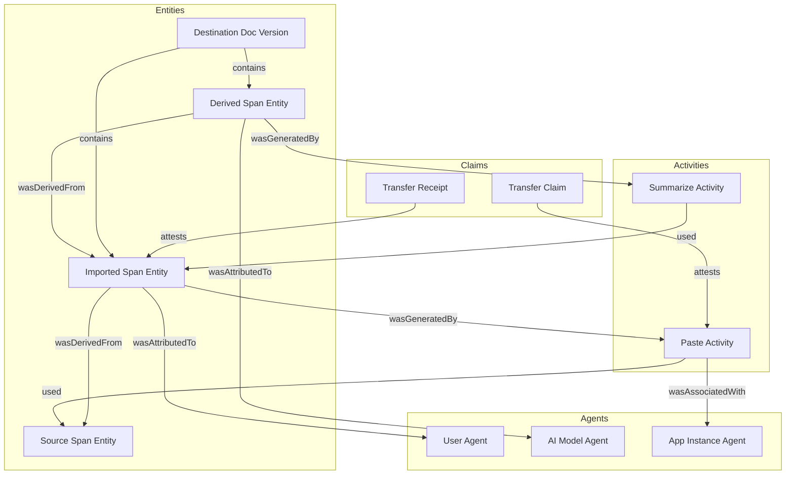
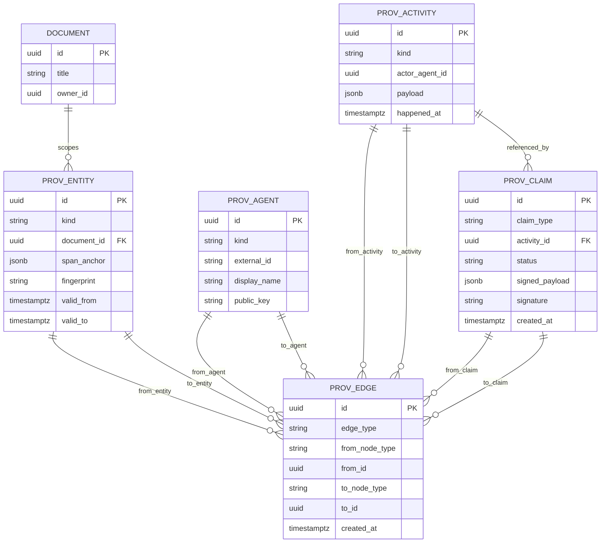
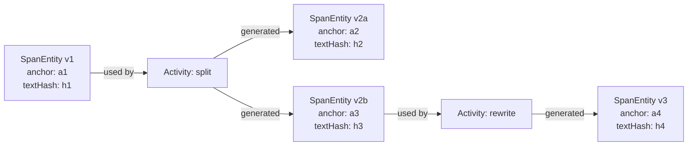

# Data Structuring for Span Provenance

## Why Option 2 Exists
Option 2 (provenance graph model) is about separating:
- **content state** (what the document looks like now)
- **provenance semantics** (how each span came to exist)

This is important because a single span can have multiple meaningful relationships at once:
- attributed to an agent (author/model)
- derived from one or more prior spans/sources
- produced by an activity (paste, summarize, rewrite)

A simple `span -> provenance_record` relation captures attribution, but not rich lineage.

## Conceptual Graph Model (PROV-like)
Use four node families:
- `Entity`: document versions, span snapshots, source artifacts
- `Activity`: edit operations and transformations
- `Agent`: users, organizations, AI systems, app instances
- `Claim`: optional signed statements (handshake claims/receipts)

And typed edges:
- `wasDerivedFrom` (Entity -> Entity)
- `wasGeneratedBy` (Entity -> Activity)
- `used` (Activity -> Entity)
- `wasAssociatedWith` (Activity -> Agent)
- `wasAttributedTo` (Entity -> Agent)
- `attests` (Claim -> Entity/Activity)

## Three Practical Structuring Alternatives

### A) Relational + typed edges (recommended now)
Tables like:
- `prov_entity(id, kind, doc_id, span_anchor, fingerprint, valid_from, valid_to, ... )`
- `prov_activity(id, kind, actor_id, payload, happened_at, ... )`
- `prov_agent(id, kind, external_id, display_name, ... )`
- `prov_edge(id, edge_type, from_node_type, from_id, to_node_type, to_id, ... )`
- `prov_claim(id, claim_type, signed_payload, signature, status, ... )`

#### Option 2 ER Diagram (typed-edge relational form)

Why this works well:
- deploys everywhere Postgres runs (Neon/Supabase/Vercel Postgres)
- compatible with Drizzle and typical operational tooling
- easy to add constraints/indexes and run transactional updates

Tradeoff:
- recursive lineage queries are more verbose (`WITH RECURSIVE`).

### B) Document-native graph blobs (JSONB)
Store lineage as JSON documents per span/version.

Why use it:
- fast iteration, less schema churn early on

Tradeoff:
- hard to enforce invariants
- harder global analytics (`who reused source X this week?`)
- migration pain once protocol stabilizes

### C) Dedicated graph database (Neo4j/Janus/etc.)
Store nodes/edges natively and query with graph traversal language.

Why use it:
- very expressive traversals and shortest-path/centrality style queries

Tradeoff:
- adds a second persistence system and sync semantics
- operational overhead (backups, failover, observability, migrations)
- weaker universality for a broadly deployable OSS POC

## Recommendation on Graph Database
For your goal (open POC, broad audience, easy self-host/deploy), a dedicated graph DB is likely **overkill for v1**.

Use Postgres as the system of record and model graph semantics relationally.
Add a graph database only if you later need one of these and can justify complexity:
1. deep multi-hop lineage queries at very high scale
2. graph analytics beyond normal product needs
3. external ecosystem already standardized on a specific graph engine

## Hybrid Pattern (best of both)
- Keep authoritative data in Postgres.
- Optional: build a derived graph projection pipeline for experimentation/analytics.
- If dropped later, product correctness is unaffected.

## Data Shape for Span Entities
Treat spans as **versioned entities**, not mutable rows.

This gives you Git-like lineage while preserving current-view performance by materializing current intervals.

## Query Classes You Should Optimize For
1. **Current view**: render all spans and attribution styles in one document.
2. **Lineage view**: trace one span backward across derivation edges.
3. **Reuse analytics**: count inbound/outbound reuse by source/author/model.
4. **Handshake status**: pending/acked/disputed transfers by instance.

If these queries are fast in Postgres with proper indexes, do not add a graph DB yet.

## Suggested Indexes (Postgres)
- `prov_entity(doc_id, valid_to)` for current spans
- `prov_entity(fingerprint)` for reuse matching
- `prov_edge(from_id, edge_type)` and `prov_edge(to_id, edge_type)`
- `prov_activity(happened_at, kind)`
- `prov_claim(status, claim_type, created_at)`

## Deployment Simplicity vs Expressiveness
- **Most universal**: Postgres-only, Drizzle-managed schema, recursive CTEs.
- **Most expressive**: dedicated graph DB plus sync.
- **Best v1 balance**: Postgres-only graph semantics, optional later projection.

## Concrete v1 Decision
1. Implement Option 2 in Postgres using typed-node/typed-edge tables.
2. Materialize `current_span_attribution` view/table for rendering speed.
3. Store handshake claims/receipts as signed payload records linked to activities/entities.
4. Defer dedicated graph database until measured query pain justifies it.
