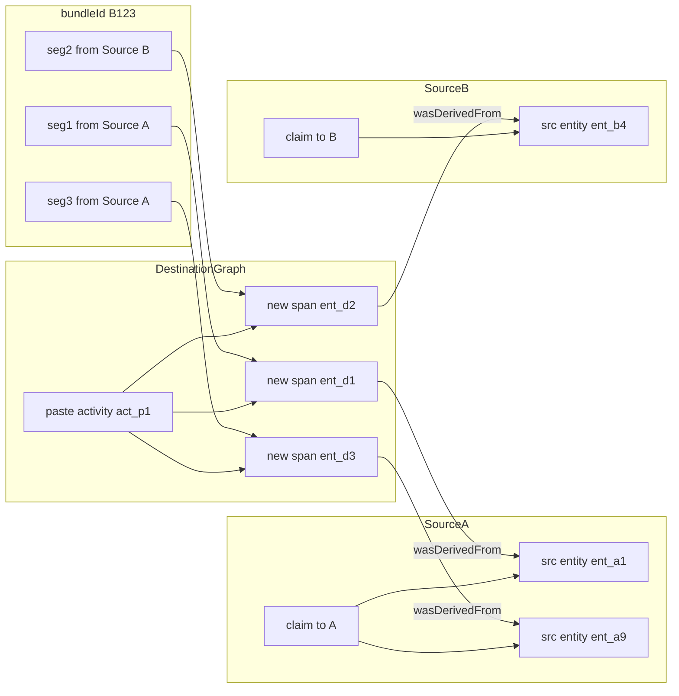
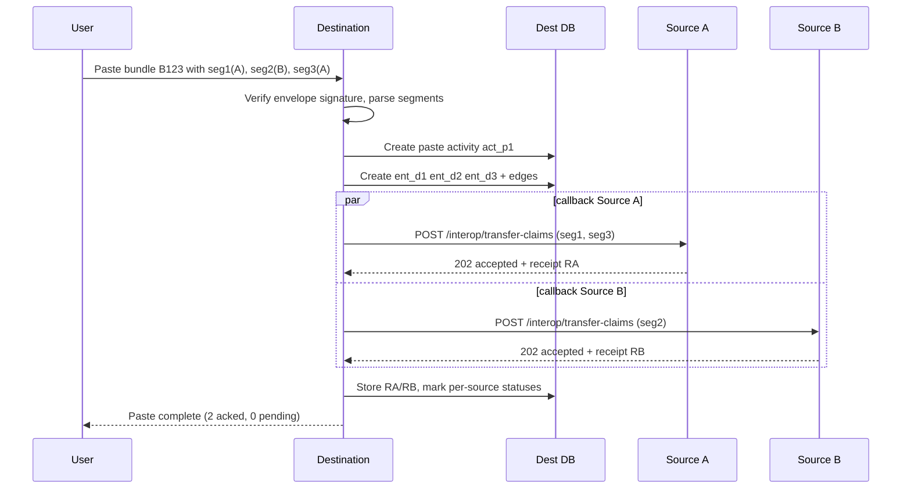

# Span Provenance Interop Protocol Draft v0.1

## 1. Purpose
This document defines an interoperable protocol profile for span-level attribution exchange between cooperative apps.

It assumes:
1. **Data model**: Option 2 from `data_structuring.md` (typed-node/typed-edge provenance graph in Postgres).
2. **Span addressing**: offset + context anchors.
3. **Handshake**: callback receipt (with optional signed acknowledgement).
4. **Clipboard transport**: custom MIME + HTML `data-*` fallback.
5. **Trust model**: instance-signed messages (Ed25519).
6. **C2PA**: generated on export, not per-keystroke.

## 2. Protocol Versioning
- Protocol identifier: `spx-prov`.
- Initial version: `0.1`.
- All messages MUST include `protocol: "spx-prov"` and `version: "0.1"`.
- Receivers MUST ignore unknown optional fields.
- Breaking changes MUST increment major version.

## 3. Interop Roles
- **Source instance**: app instance from which content originated.
- **Destination instance**: app instance receiving pasted/imported content.
- **Agent**: user, org, model, or app instance.
- **Verifier**: service/component validating signatures and claim structure.

## 4. Canonical Identifiers
All IDs are opaque strings, globally unique.
- `entityId`: provenance entity (span snapshot, doc version, source artifact)
- `activityId`: operation event (paste, rewrite, summarize)
- `agentId`: identity node
- `claimId`: handshake claim
- `receiptId`: handshake receipt
- `bundleId`: clipboard transfer bundle

Recommended format: UUIDv7.

## 5. Core Node/Edge Semantics (Option 2)
### 5.1 Node kinds
- `prov_entity.kind`: `span_snapshot | document_version | source_artifact`
- `prov_activity.kind`: `paste | import | rewrite | summarize | merge | split`
- `prov_agent.kind`: `user | organization | model | instance`
- `prov_claim.claim_type`: `transfer_claim | transfer_receipt`

### 5.2 Edge types
- `used` (`activity -> entity`)
- `wasGeneratedBy` (`entity -> activity`)
- `wasDerivedFrom` (`entity -> entity`)
- `wasAttributedTo` (`entity -> agent`)
- `wasAssociatedWith` (`activity -> agent`)
- `attests` (`claim -> activity|entity`)
- `contains` (`document_version -> span_snapshot`)

Receivers MUST reject edges whose node types do not match allowed pairs.

## 6. Span Addressing and Fingerprints
Each `span_snapshot` entity MUST include:
- `anchor.start.offset`
- `anchor.start.leftContextHash`
- `anchor.start.rightContextHash`
- `anchor.end.offset`
- `anchor.end.leftContextHash`
- `anchor.end.rightContextHash`
- `textHash` (canonicalized text hash)

Canonicalization v0.1:
1. Normalize to UTF-8.
2. Normalize newlines to `\n`.
3. Trim no characters (whitespace is meaningful).
4. Hash using SHA-256 with prefix `sha256:`.

## 7. Clipboard Envelope
Destination SHOULD attempt parse in this order:
1. `application/x-provenance+json`
2. `text/html` with `data-prov-*` attributes
3. prompt user for attribution (fallback)

### 7.1 Envelope shape
```json
{
  "protocol": "spx-prov",
  "version": "0.1",
  "bundleId": "01J...",
  "sourceInstance": "https://writer.example",
  "sourceDocument": {
    "documentId": "doc_src_123",
    "documentVersionId": "docv_src_45"
  },
  "segments": [
    {
      "segmentId": "seg_1",
      "order": 0,
      "text": "Quoted sentence A.",
      "entityId": "ent_span_A1",
      "attribution": {
        "primaryAgentId": "agent_user_alice",
        "sourceArtifactUrl": "https://writer.example/post/abc",
        "classification": "quoted"
      },
      "anchor": {
        "start": {"offset": 120, "leftContextHash": "sha256:...", "rightContextHash": "sha256:..."},
        "end": {"offset": 138, "leftContextHash": "sha256:...", "rightContextHash": "sha256:..."}
      },
      "textHash": "sha256:..."
    }
  ],
  "signature": {
    "alg": "Ed25519",
    "kid": "did:key:z...#instance-key-1",
    "sig": "base64..."
  }
}
```

## 8. Multi-Span, Multi-Origin Paste (Key Behavior)
A single paste can contain segments from different origins. The protocol treats each segment as independently attributable while sharing one `bundleId`.

Rules:
1. Destination MUST preserve segment order.
2. Destination MUST create one `paste` activity per paste operation.
3. Destination MUST create one generated `span_snapshot` entity per pasted segment.
4. Destination MUST add `wasDerivedFrom` edge per segment when source entity known.
5. Destination MUST group outbound callbacks by `sourceInstance`.
6. If one source callback fails, other source callbacks MUST still proceed.
7. Each source gets claim payload containing only its relevant segments.

### 8.1 Multi-origin data mapping


### 8.2 Multi-origin sequence


### 8.3 Partial failure example
If Source B is unreachable:
- A path is `acknowledged`.
- B path is `pending` with retry schedule.
- UI SHOULD show per-segment/per-source status, not one global paste status.

## 9. Handshake API Contract

### 9.1 Discovery
Source capability discovery (recommended):
- `GET /.well-known/provenance-interop`

Response:
```json
{
  "protocol": "spx-prov",
  "version": "0.1",
  "transferClaimsEndpoint": "https://source.example/interop/transfer-claims",
  "jwksUri": "https://source.example/.well-known/jwks.json",
  "supportsSignedReceipt": true
}
```

### 9.2 Transfer claim endpoint
- `POST /interop/transfer-claims`
- AuthN: detached signature in payload + optional bearer token.
- Idempotency: `Idempotency-Key` header SHOULD be `claimId`.

Request shape:
```json
{
  "protocol": "spx-prov",
  "version": "0.1",
  "claimId": "01J...",
  "bundleId": "01J...",
  "sourceInstance": "https://source.example",
  "destination": {
    "instance": "https://dest.example",
    "documentId": "doc_dst_999",
    "documentVersionId": "docv_dst_17",
    "agentId": "agent_user_42"
  },
  "activity": {
    "activityId": "act_p1",
    "kind": "paste",
    "happenedAt": "2026-02-28T16:41:22Z"
  },
  "segments": [
    {
      "segmentId": "seg_1",
      "destinationEntityId": "ent_d1",
      "sourceEntityId": "ent_a1",
      "textHash": "sha256:...",
      "chars": 182,
      "classification": "quoted"
    }
  ],
  "signature": {
    "alg": "Ed25519",
    "kid": "did:key:z...#instance-key-1",
    "sig": "base64..."
  }
}
```

Response (sync receipt):
```json
{
  "protocol": "spx-prov",
  "version": "0.1",
  "receiptId": "01J...",
  "claimId": "01J...",
  "status": "accepted",
  "sourceReference": "reuse_evt_556",
  "receivedAt": "2026-02-28T16:41:23Z",
  "signature": {
    "alg": "Ed25519",
    "kid": "did:key:z...#instance-key-2",
    "sig": "base64..."
  }
}
```

Allowed status values:
- `accepted`
- `accepted_unsigned`
- `rejected_invalid_signature`
- `rejected_unknown_source_entity`
- `rejected_policy`
- `pending_async`

## 10. Destination Persistence Rules
On successful paste processing, destination MUST persist:
1. one `prov_activity(kind=paste)`
2. one `prov_entity(kind=span_snapshot)` per segment
3. edges:
   - `used(activity -> source_entity)` where source entity known
   - `wasGeneratedBy(new_entity -> activity)`
   - `wasDerivedFrom(new_entity -> source_entity)` when provided
   - `wasAttributedTo(new_entity -> agent)` using imported or user-provided attribution
4. one `prov_claim(claim_type=transfer_claim)` per source instance callback
5. one `prov_claim(claim_type=transfer_receipt)` when response received

## 11. Validation Rules
Receiver MUST validate:
1. protocol/version compatibility
2. signature against sender key
3. segment `textHash` matches provided segment text when present
4. no duplicate `segmentId` within bundle
5. segment ordering is contiguous by `order`
6. source instance in payload matches receiving instance for callback claims

On validation failure, receiver MUST return `4xx` with machine-readable error code.

## 12. Retry and Idempotency
- Destination SHOULD retry failed callbacks with exponential backoff.
- Source MUST treat duplicate `claimId` as idempotent replay.
- If source returns `pending_async`, destination SHOULD poll or accept webhook callback.

## 13. Security Profile (v0.1)
- Signature algorithm: Ed25519.
- Key distribution: JWKS or DID key document.
- Key rotation: supported via `kid`.
- Minimum audit fields: `createdAt`, `senderInstance`, `kid`, `claimId`, hash of raw payload.

## 14. Mapping to C2PA at Export
At export time:
1. Build C2PA ingredient references from `wasDerivedFrom` source entities.
2. Build C2PA action assertions from `prov_activity` chain.
3. Include attribution metadata derived from `wasAttributedTo` edges.
4. Sign export artifact manifest with exporter identity.

## 15. Interop Conformance Levels
- **Level 1 (import-only)**: parse bundle and preserve attribution locally.
- **Level 2 (callback)**: send transfer claims and record receipts.
- **Level 3 (signed mutual attestation)**: enforce signed receipts and stricter policy validation.

POC target: **Level 2**.

## 16. Minimal Interop Test Vectors
1. Single span from one source, signed, accepted.
2. Three spans from two sources, one source unreachable (partial pending).
3. Missing provenance payload, user-supplied attribution fallback.
4. Invalid signature rejection.
5. Replay of same `claimId` (idempotent response).

## 17. Implementation Notes for Next.js + Tiptap + Drizzle + BetterAuth
- Keep Tiptap marks thin: store `entityId` references only.
- Materialize current spans for fast rendering.
- Run callback handshake in background jobs/queue to avoid blocking paste UX.
- Use BetterAuth identity for user agents; separate instance keys for interop signing.

## 18. Open Items for v0.2
1. Canonical text normalization hardening for cross-language edge cases.
2. Dispute/revocation protocol after accepted receipt.
3. Privacy controls for source-side reuse analytics.
4. Optional zero-knowledge or redacted transfer proofs.
