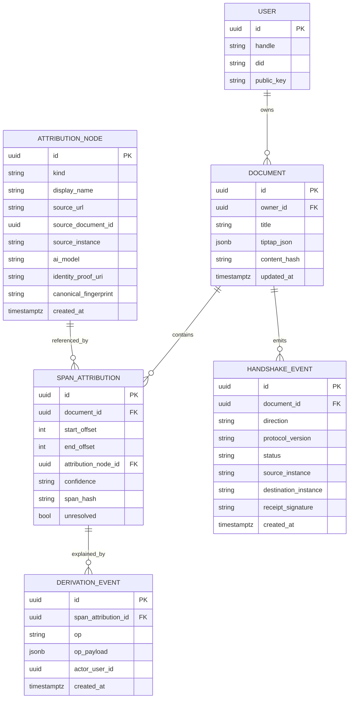
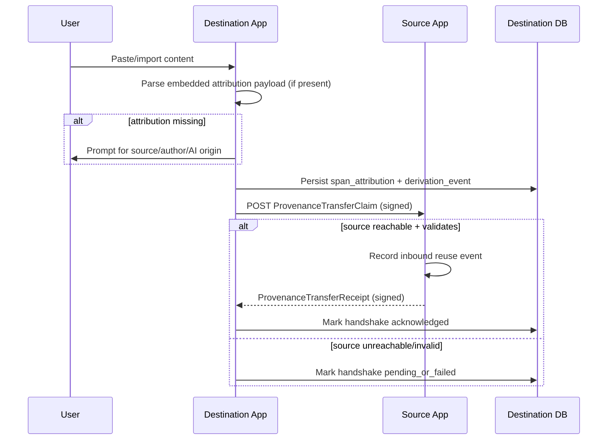
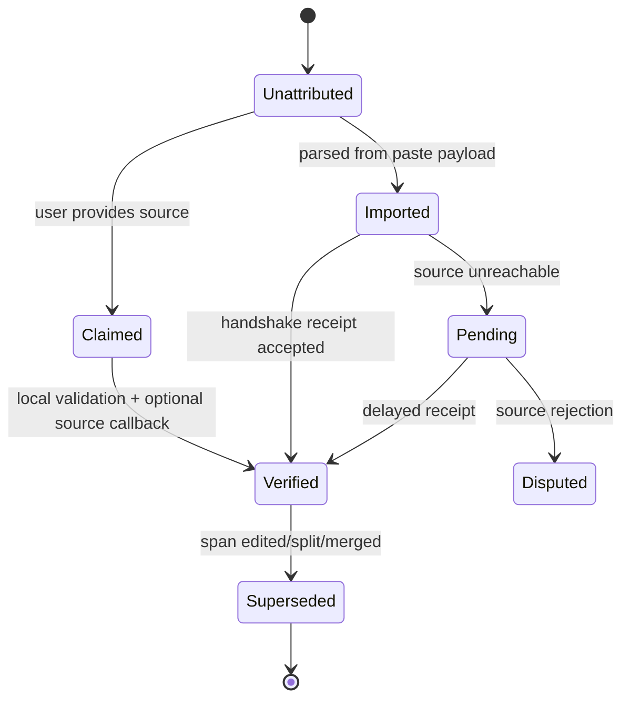

# Protocol + Modelling Draft v1

## Scope
This draft focuses on two foundations for the cloud POC:
- how span-level attribution is modelled in storage and editor state
- how two app instances perform a provenance handshake when content moves between them

It is intentionally protocol-first, so UI and feature details are secondary.

## Design Goals
1. Preserve attribution through edit operations (insert/delete/split/merge).
2. Keep provenance tamper-evident (detect silent mutation).
3. Support both attributed and initially unattributed paste/import flows.
4. Allow source-side visibility into reuse (optional acknowledgement handshake).
5. Map cleanly to C2PA export while not requiring C2PA at edit-time.
6. Remain LLM-friendly (structured, machine-readable spans + events).

## Non-goals (POC v1)
- Full federated trust network.
- Perfect cryptographic identity for all external web sources.
- Real-time multi-party CRDT provenance convergence.

## Core Concepts
- `Span`: contiguous character interval with one active attribution binding.
- `AttributionNode`: canonical source descriptor (human/AI/external/document).
- `AttributionEdge`: claim that a span is derived from an AttributionNode.
- `DerivationEvent`: immutable event explaining how an edge was created.
- `Receipt`: signed or unsigned confirmation exchanged between source and destination instances.

## Modelling Alternatives

### Alternative A: Inline-Mark Dominant (Tiptap-centric)
Store provenance primarily in editor marks; database mirrors it asynchronously.

Pros:
- Fast to prototype in Tiptap.
- Easy per-span rendering.

Cons:
- Harder to guarantee consistency after complex edits.
- Server-side analytics depend on successful extraction.

Best use:
- early demos where UX speed is more important than audit guarantees.

### Alternative B: Interval Table as Source of Truth (DB-centric)
Store document text plus normalized span intervals (`start`, `end`, `attribution_id`) as canonical; Tiptap marks are view projections.

Pros:
- Strong queryability and analytics.
- Cleaner provenance graph and source dashboard features.

Cons:
- Requires robust position remapping on edits.
- More backend complexity.

Best use:
- cloud POC with handshake analytics and attribution reporting.

### Alternative C: Event-Sourced Piece Table (Git-like provenance evolution)
Persist immutable edit/attribution events, derive current intervals through compaction/materialization.

Pros:
- Excellent auditability (who changed what, when).
- Natural fit for Git-inspired blame/history semantics.

Cons:
- Highest implementation complexity.
- Requires background materializers/snapshots.

Best use:
- later phase when protocol stability is established.

## Recommended Path
Use **Alternative B now**, while recording enough derivation events to migrate toward C later.

## Data Model Options

### Option 1: Minimal relational model (POC fastest)



### Option 2: Provenance graph model (more expressive)
Use graph semantics in SQL:
- `prov_entity` (content entities: span snapshot, document version)
- `prov_agent` (human, org, model)
- `prov_activity` (paste, transform, summarize, edit)
- `prov_edge` (`wasDerivedFrom`, `wasAttributedTo`, `used`, `wasGeneratedBy`)

This aligns with W3C PROV patterns and maps cleanly to C2PA ingredient/action thinking.

## Span Addressing Alternatives

### Addressing A: Absolute UTF-16 offsets
- Works directly with ProseMirror positions.
- Easy in single-version operations.
- Fragile across rebases or external transforms.

### Addressing B: Anchors with context windows
Each boundary stores `(offset, left_context_hash, right_context_hash)`.
- Better resilience after nearby edits.
- Slightly more storage and remapping logic.

### Addressing C: Structural path + text hash
Store path in doc tree (`nodePath`, `textRunIndex`) plus local hash.
- Robust to many textual changes.
- More complex with document normalization.

Recommendation for POC: **B** (offset + context anchors).

## Handshake Protocol Alternatives

### Handshake 1: Passive Receipt (destination-only citation)
Destination stores attribution; no callback to source.
- Simplest, no source infra required.
- Does not satisfy source visibility goal.

### Handshake 2: Callback Receipt (source notified)
Destination POSTs signed receipt to source endpoint.
- Enables source dashboard and acknowledgement.
- Needs discoverable source endpoint and auth.

### Handshake 3: Mutual Attestation (two-phase)
1. Destination sends claim with span fingerprints.
2. Source verifies and returns acknowledgement signature.
3. Destination finalizes `acknowledged=true`.
- Strongest trust semantics.
- More latency and retry complexity.

Recommendation for POC: **Handshake 2**, with optional upgrade to 3 when source supports ack signing.

## Suggested Handshake Message Shapes

### `ProvenanceTransferClaim` (destination -> source)
```json
{
  "protocolVersion": "0.1",
  "claimId": "uuid",
  "sentAt": "2026-02-28T14:00:00Z",
  "source": {
    "instance": "https://source.app",
    "documentId": "doc_src_123",
    "attributionNodeId": "attr_abc"
  },
  "destination": {
    "instance": "https://dest.app",
    "documentId": "doc_dst_999",
    "userId": "user_42"
  },
  "spans": [
    {
      "fingerprint": "sha256:...",
      "chars": 182,
      "classification": "quoted"
    }
  ],
  "signature": {
    "alg": "ed25519",
    "kid": "did:key:z...#1",
    "sig": "base64..."
  }
}
```

### `ProvenanceTransferReceipt` (source -> destination)
```json
{
  "protocolVersion": "0.1",
  "claimId": "uuid",
  "status": "accepted",
  "acknowledgedAt": "2026-02-28T14:00:02Z",
  "sourceReference": "reuse_evt_556",
  "signature": {
    "alg": "ed25519",
    "kid": "did:key:z...#2",
    "sig": "base64..."
  }
}
```

## Handshake Sequence (recommended)



## Clipboard Transport Alternatives

### Clipboard A: Web custom MIME payload
Add JSON in `application/x-provenance+json` alongside plain text/html.
- Best UX between cooperative apps.
- Browser/platform support varies.

### Clipboard B: HTML `data-*` embedded tags
Wrap spans in HTML with provenance IDs and signed envelope reference.
- Works in rich-text paste flows.
- Can be stripped by sanitizers.

### Clipboard C: Out-of-band lookup token
Clipboard carries token; destination resolves full provenance via API.
- Lightweight payload, easier revocation.
- Requires network at paste time.

Recommendation for POC: support **A + B**; fallback to source prompt.

## Git + C2PA Hybrid Concepts

### Git-inspired pieces
- `blame` view for span ownership over current text.
- immutable event log for edit attribution.
- line/span fingerprinting for reuse detection.

### C2PA-inspired pieces
- signed export manifest chain per document version.
- ingredient-style references for imported sources.
- action assertions for transformation semantics.

### Hybrid rule
At edit-time: lightweight, DB-native provenance model.
At export-time: compile current state + history into C2PA manifest(s).

## State Model for a Span Attribution



## Integrity and Authentication Alternatives

### Trust Level 0: Unsigned metadata
Fastest; useful for UX demo only.

### Trust Level 1: Instance-signed claims (recommended POC)
Each app instance signs handshake messages with rotating keys.

### Trust Level 2: User-signed span claims
Per-user signatures for high-assurance authoring.

### Trust Level 3: Verifiable credentials / DID-based agents
Best for federation; defer until post-POC.

## MCP-Friendly API Surface (v0)
Expose protocol primitives via MCP tools so LLM agents can reason over provenance.

- `create_attribution_node`
- `annotate_span`
- `list_span_lineage`
- `submit_transfer_claim`
- `resolve_transfer_receipt`
- `export_c2pa_manifest`

Example lineage response should be structured and bounded:
- current attribution node
- derivation chain depth
- handshake status
- trust level

## POC Recommendation Summary
1. Use **DB-centric interval model (Alternative B)** with context anchors.
2. Implement **Callback Receipt handshake (Handshake 2)** with optional signed ack.
3. Use **instance-level signatures** first (Trust Level 1).
4. Support **clipboard MIME + HTML data attributes** with prompt fallback.
5. Compile provenance into **C2PA manifests on export**, not on every keystroke.
6. Persist immutable `derivation_event` records now to enable future Git-like blame/history views.

## Open Questions to Resolve in Draft v2
1. Canonical span fingerprint algorithm (normalization, whitespace, Unicode strategy).
2. Conflict handling when two sources claim the same pasted span.
3. Revocation semantics when a source disputes attribution after acceptance.
4. Privacy model for source-side analytics (opt-in, aggregation, retention).
5. Federation discovery: how destination finds source handshake endpoint.
